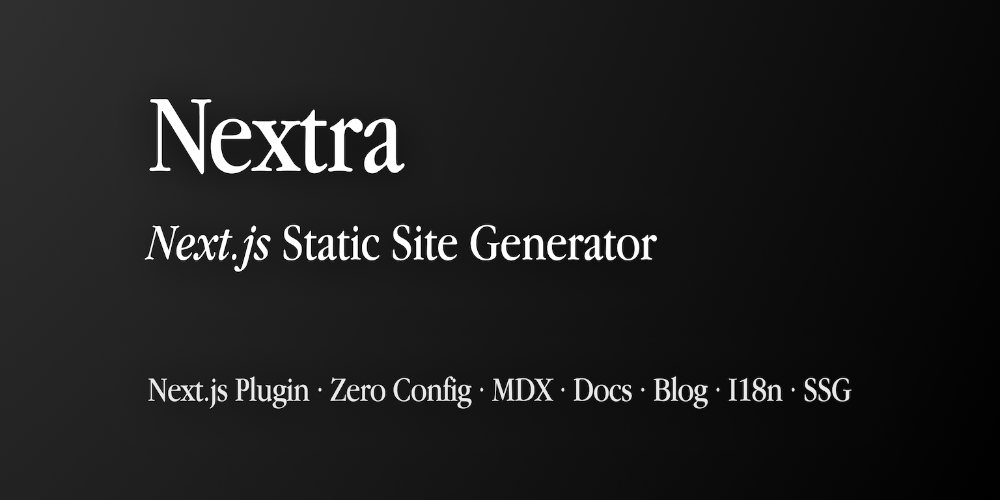

# MD file - text formatting tags
Markdown (MD) is a standard for text formatting used on many websites.
For understanding basic capabilities of MD the [MD Cheatsheet](https://github.com/adam-p/markdown-here/wiki/Markdown-Cheatsheet) is a recommended reading.

## Emphasis

````markdown
Emphasis, aka italics, with *asterisks* or _underscores_.
````
Renders:
Emphasis, aka italics, with *asterisks* or _underscores_.


Strong emphasis, aka bold, with **asterisks** or __underscores__.

Combined emphasis with **asterisks and _underscores_**.

Strikethrough uses two tildes. ~~Scratch this.~~
Emphasis, aka italics, with asterisks or underscores.

Strong emphasis, aka bold, with asterisks or underscores.

Combined emphasis with asterisks and underscores.

Strikethrough uses two tildes. Scratch this.

## Tag text as Headings

<br />
{/* using html tag <br> to avoid being combined with next line */}

# **Hello**, This Is a _Title_ Inside `h1`

<h2>**Hello**, This Is a _Title_ Inside `h2`</h2>
{/* using html tag <h2> instead of md ## to avoid being rendered in the sidebar */}

### **Hello**, This Is a _Title_ Inside `h3`

#### **Hello**, This Is a _Title_ Inside `h4`

##### **Hello**, This Is a _Title_ Inside `h5`

###### **Hello**, This Is a _Title_ Inside `h6`

## List

1. one
2. two
3. three

- one
- two
- three

## Blockquote

> Where some people measure progress in answers-right per test or tests-passed per year, we are more interested in Sistine-Chapel-Ceilings per Lifetime.
>
> — Alan Kay, A Personal Computer for Children of All Ages

Nested quotes:

> > Where some people measure progress in answers-right per test or tests-passed per year, we are more interested in Sistine-Chapel-Ceilings per Lifetime.
> >
> > — Alan Kay, A Personal Computer for Children of All Ages
>
> This is **great**.
>
> — Shu Ding.

## Table

| Syntax        | Description |   Test Text |
| :------------ | :---------: | ----------: |
| Header        |    Title    | Here's this |
| Paragraph     |    Text     |    And more |
| Strikethrough |             |    ~~Text~~ |

## Adding an Image

Nextra also supports automatic static image imports, you no longer need to specify the width and height of the image manually,
and you can directly use the Markdown syntax to display the same image:

```
markdown tag

```

With Next.js Image, there will be no layout shift, and a beautiful blury placeholder will be shown by default when loading the images:

<br />



## Task List

```markdown
- [x] Write the press release
- [ ] Update the website
- [ ] Contact the media
```

Renders

- [x] Write the press release
- [ ] Update the website
- [ ] Contact the media
